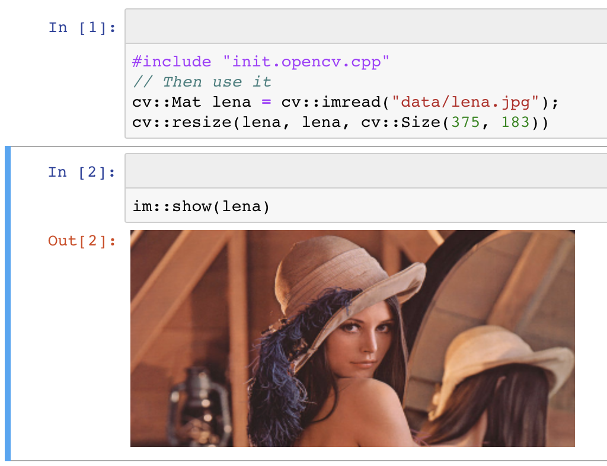

# Read-Eval-Print-Loop (REPL) in C++

A Read-Eval-Print-Loop enables to leverage very rapid application development.
This kind of environment is normaly reserved to scripting languages (python, nodejs)
and to functional languages (lisp, haskell).

[Cling](https://github.com/root-project/cling) realizes the read-eval-print loop (REPL) concept for the C++ language.
Thus, you can gain in speed of development while the compiler (clang) still checks your code and guarantees a native speed of execution.

<table>
<tr>
  <td>
    <a href="Shell_Functional_REPL.md.html" target="_blank">
      
      C++ REPL in a console
    </a>
  </td>
  <td>
    &nbsp;&nbsp;&nbsp;
    &nbsp;&nbsp;&nbsp;
    &nbsp;&nbsp;&nbsp;
  </td>
  <td>
    <a href="/notebooks/1_opencv_example.html" target="_blank">
      
      C++ REPL inside jupyter notebook
    </a>
  </td>
</tr>
</table>

# REPL interactive shell session

You can run a full C++ REPL from your console. In order to test this, the easiest way is to install
the provided docker container. Refer to [the docker instructions](parts/docker.md.html)

See an example of an interactive C++ session [here](Shell_Functional_REPL.md.html).

# Notebooks
### How to navigate in these notebooks

*if you are reading this inside jupyter notebook*
* Click on the "Run" button at the top in order to run each cell (or type "Shift + Enter" in order to run it, and go to the next cell)
* For a better undertsanding, it is better to clear the outputs below: click on the "Kernel" menu, and select "Restart & Clear Output"

*If you are viewing a slideshow*
* navigate forward using the space bar
* also use the arrows in the bottom right corner

### Advices and Gotchas when using cling and jupyter

The cling and xeus docs are good, but some informations are missing : this notebook adds more details.

Choose between 4 ways to view this document:
* <a href="../notebooks/3_Advices_And_Gotchas.html" target="_blank">Static page</a>
* <a href="../notebooks/3_Advices_And_Gotchas.slides.html" target="_blank">As a slideshow</a>
* <a href="https://mybinder.org/v2/gh/pthom/Cling_Repl_Demo/master?filepath=notebooks%2F3_Advices_And_Gotchas.ipynb"
  target="_blank">Interactive notebook online</a>
  (Requires 1 minute to load : it is recommended to open this link in a separate tab)
* <a href="http://localhost:8888/notebooks/3_Advices_And_Gotchas.ipynb" target="_blank">Open notebook from you local clone of this repo</a>

### A REPL session of C++ functional programming, using fplus

A Read-Eval-Print-Loop makes functional programing very proficient. This notebook demonstrates it. If you are new to functional programming, it is recommended to view it as a slideshow.

Choose between 4 ways to view this document:
* <a href="../notebooks/2_Functional_REPL.html" target="_blank">Static page</a>
* <a href="../notebooks/2_Functional_REPL.slides.html" target="_blank">As a slideshow</a>
* <a href="https://mybinder.org/v2/gh/pthom/Cling_Repl_Demo/master?filepath=notebooks%2F2_Functional_REPL.ipynb"
  target="_blank">Interactive notebook online</a>
  (Requires 1 minute to load : it is recommended to open this link in a separate tab)
* <a href="http://localhost:8888/notebooks/2_Functional_REPL.ipynb" target="_blank">Open notebook from you local clone of this repo</a>

### A session of REPL / C++ with opencv

Load, display and manipulate images with opencv. Demonstrates how to load an external library and display advanced items.

Choose between 4 ways to view this document:
* <a href="../notebooks/1_opencv_example.html" target="_blank">Static page</a>
* <a href="../notebooks/1_opencv_example.slides.html" target="_blank">As a slideshow</a>
* <a href="https://mybinder.org/v2/gh/pthom/Cling_Repl_Demo/master?filepath=notebooks%2F1_opencv_example.ipynb"
  target="_blank">Interactive notebook online</a>
  (Requires 1 minute to load : it is recommended to open this link in a separate tab)
* <a href="http://localhost:8888/notebooks/1_opencv_example.ipynb" target="_blank">Open notebook from you local clone of this repo</a>

### Display friendly type names

Trying to solve the sad state of variables introspection at runtime: display a clean type, introspect lambda params and return types, etc.

Choose between 4 ways to view this document:
* <a href="../notebooks/typename.html" target="_blank">Static page</a>
* <a href="../notebooks/typename.slides.html" target="_blank">As a slideshow</a>
* <a href="https://mybinder.org/v2/gh/pthom/Cling_Repl_Demo/master?filepath=notebooks%2Ftypename.ipynb"
  target="_blank">Interactive notebook online</a>
  (Requires 1 minute to load : it is recommended to open this link in a separate tab)
* <a href="http://localhost:8888/notebooks/typename.ipynb" target="_blank">Open notebook from you local clone of this repo</a>

# Installation : how to test these examples on your computer

### Docker : quick test without modifying your machine
If you do not want to modify your machine, you can use the docker image provided inside this repo.

Refer to [the docker instructions](parts/docker.md.html).

### Full installation on your machine
Refer to the instructions on the [xeus cling web page](https://github.com/QuantStack/xeus-cling)

### I don't want to install anything!

As mentioned before, these demos are [available online on mybinder.org](https://mybinder.org/v2/gh/pthom/Cling_Repl_Demo/master?filepath=examples%2Fnotebooks%2F).
# About cling

> [Cling](https://github.com/root-project/cling) is an interactive C++ interpreter, built on top of Clang and LLVM compiler infrastructure. Cling realizes the read-eval-print loop (REPL) concept, in order to leverage rapid application development. Implemented as a small extension to LLVM and Clang, the interpreter reuses their strengths such as the praised concise and expressive compiler diagnostics.

It is based on the Root data analysis framework, and originates from the CERN. Cling is stil under heavy development and might fail (for example a segfault in your program will exit cling REPL). However it is quite useful, and used everyday at the CERN.
# About xeus cling

[Xeus cling](https://github.com/QuantStack/xeus-cling) is a Jupyter kernel for the C++ programming language based on cling.

Read the docs [here](https://xeus-cling.readthedocs.io/en/latest/).
# Intro to jupyter notebook

If you do not know jupyter notebook, take some time to familiarize yourself with the concept here:
* [Official site](http://jupyter.org/)
* [Try in online on the official site](http://jupyter.org/try)
* [Quick introduction to Jupyter Notebook](https://www.youtube.com/watch?v=jZ952vChhuI) (youtube video, 7')

