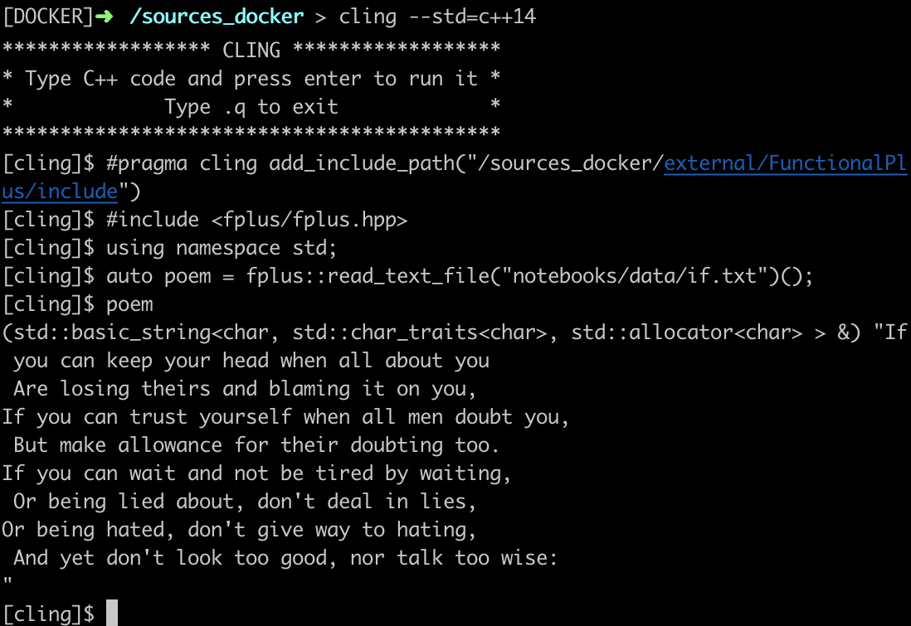
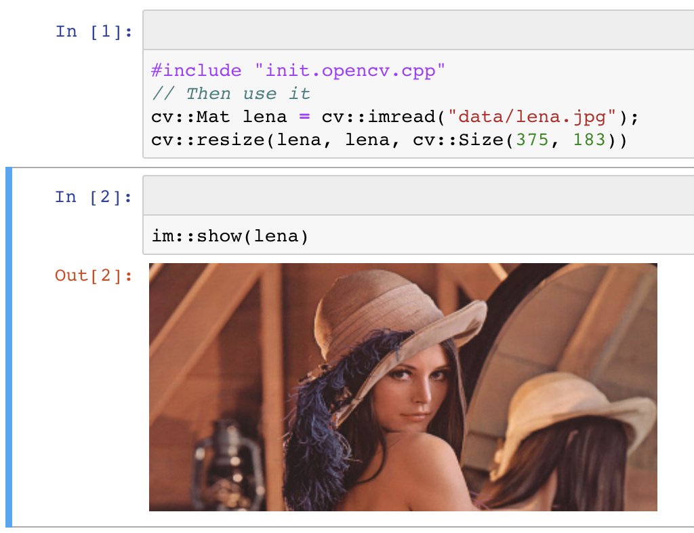

# Read-Eval-Print-Loop (REPL) in C++

A Read-Eval-Print-Loop enables to leverage very rapid application development.
This kind of environment is normaly reserved to scripting languages (python, nodejs)
and to functional languages (lisp, haskell).

[Cling](https://github.com/root-project/cling) realizes the read-eval-print loop (REPL) concept for the C++ language.
Thus, you can gain in speed of development while the compiler (clang) still checks your code and guarantees a native speed of execution.

<table>
<tr>
  <td>
    <a href="Shell_Functional_REPL.md.html">
      
      C++ REPL in a console
    </a>
  </td>
  <td>
    &nbsp;&nbsp;&nbsp;
    &nbsp;&nbsp;&nbsp;
    &nbsp;&nbsp;&nbsp;
  </td>
  <td>
    <a href="../notebooks/1_opencv_example.html">
      
      C++ REPL inside jupyter notebook
    </a>
  </td>
</tr>
</table>

# REPL interactive shell session

You can run a full C++ REPL from your console. In order to test this, the easiest way is to install
the provided docker container. Refer to [the docker instructions](parts/docker.md.html)

See an example of an interactive C++ session [here](Shell_Functional_REPL.md.html).

# Notebooks
>>INCLUDE parts/navigate.md
>>INCLUDE _gen.all_notebooks.md

>>INCLUDE parts/install.md
>>INCLUDE parts/cling.md
>>INCLUDE parts/xeus_cling.md
>>INCLUDE parts/jupyter_notebook.md
